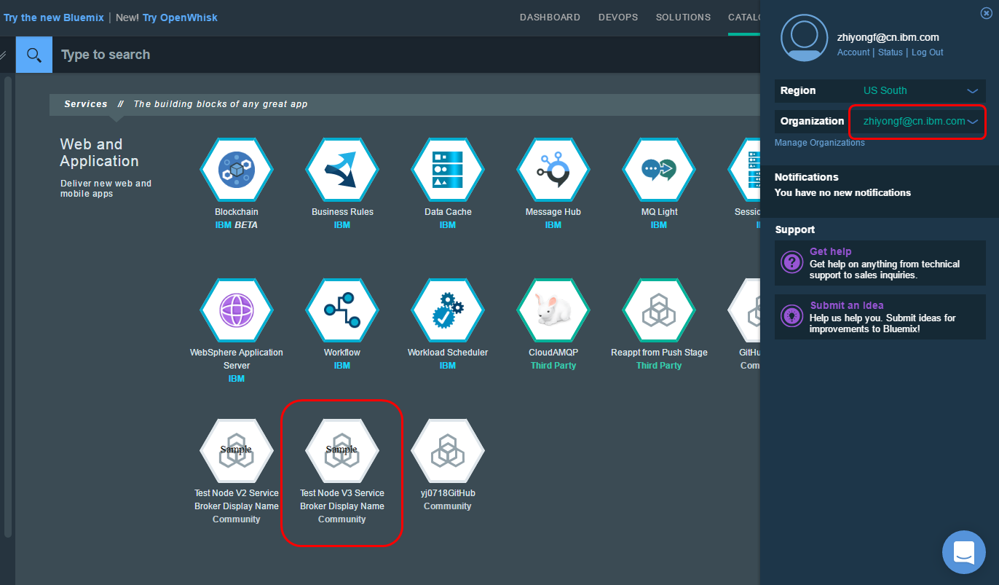

# Building a service broker for Node.js in Bluemix
To build services and to integrate them with IBM® Bluemix™, you must implement and deploy your services, implement the service brokers for the services, and then register the service brokers with Bluemix.

Service brokers are RESTful web services that extend your services and integrate your services with Bluemix. Service brokers in Bluemix provide the following capabilities:
*   Populate the service catalog that is displayed in both the Bluemix user interface and the output of the cf marketplace command.
*   Make your services available to applications in Bluemix by responding to requests such as provisioning and binding. After an instance of the service is provisioned and bound to an application by using the service broker, the application can interact with the service instance directly without the service broker.

## Steps to Build and integrate services to Bluemix
The process for building and integrating a service into Bluemix consists of the following tasks:
1.	Implement your service. You can create and deploy your service as an application in Bluemix.
2.	Ensure that you have all the resources that are required for your service to be displayed in the Bluemix user interface, and ensure that all the resources meet Bluemix requirements. 
3.	Ensure that you have all the resources that are required for the user interface of your service instances to be displayed in the Bluemix Dashboard. Then, provide the URL of the user interface of your service instances in the response of the Provision endpoint. 
4.	Implement the service broker API endpoints of Catalog, Provision, and Unprovision. If your service can be bound to applications in Bluemix, you must also implement the Bind and Unbind endpoints. 
5.	Register the service broker with Bluemix by using the bluemix command line with catalog manager plugin

## Example: Build and integrate a service
#### Deploy this service to Bluemix as an application
1. Create a Bluemix Account:
    
    [Sign up][sign_up] in Bluemix, or use an existing account

2.  Download and install the [Cloud-foundry CLI][cloud_foundry] tool
3.  Edit the `manifest.yml` file, and change `<application-name>` to something unique.
    ```none
    pplications:
    - disk_quota: 1024M
      name: <application-name>
      command: node app.js
      path: .
      domain: stage1.mybluemix.net
      instances: 1
      memory: 128M
    ```
    The name you use determines your initial application URL, 
    e.g. `<application-name>.stage1.mybluemix.net`

4.  Connect to Bluemix in the command line tool
    
    ```sh
    $ cf api https://api.stage1.ng.bluemix.net
    $ cf login -u <your user ID>
    ```
    
5.  Push

    ```sh
    $ cf push
    ```

####    Check required resource files for Bluemix Catalog Endpoint
Resources that are required include the icon images, the Quick Start guide, and the documentation for your service. After you have all the resources, provide them in the response of the Catalog endpoint. 
####    Implement service broker API endpoints for Catalog, Provision, Unprovisionm Bind and Unbind
refer to [app.js](app.js) for below apis
```
expressServer.get("/v2/catalog", basicAuth, catalog);
expressServer.put("/v2/service_instances/:instance_id", basicAuth, provision);
expressServer.put("/v2/service_instances/:instance_id/service_bindings/:binding_id", basicAuth, bind);
expressServer.del("/v2/service_instances/:instance_id/service_bindings/:binding_id", basicAuth, unbind);
expressServer.del("/v2/service_instances/:instance_id", basicAuth, unprovision);
expressServer.patch("/v2/service_instances/:instance_id", basicAuth, update);
```
####    Create a service broker definition JSON, see Service broker definition
Create a [broker-sample.json](broker-sample.json) as below:
```
{
    "name": "frankinbroker",
    "broker_url": "http://testservicenode3.stage1.mybluemix.net",
    "auth_username": "TestServiceBrokerUser",
    "auth_password": "TestServiceBrokerPassword",
    "owningOrganization": "zhiyongf@cn.ibm.com",
    "serviceKeysSupported": false,
    "visibilities": [
        {"organization_name": "zhiyongf@cn.ibm.com"}
    ]
}
```
####    Register the service broker by using the bluemix service-broker-create command. For more information, see Catalog Manager Plugin
1.  Download and install [bluemix command line][bluemix_cli]
2.  Download and install [bluemix catalog manager plugin][catalog_manager], please refer to [Catalog Manager CLI][catalog_cli] for more information.
3.  Create service broker using below command 
``` 
BLUEMIX_TRACE=true BLUEMIX_TRACE=./trace.log bluemix catalog service-broker-create ./testservicenode2.json --no-billing
```
_note_: The log will be writen into ./trace.log if any error happen during create service broker.

When the service broker has been created successfully, you can find it in both [Bluemix Catalog][bluemix_catalog] and cf marketplace in your own oranization.



[cloud_foundry]: https://github.com/cloudfoundry/cli
[sign_up]: https://console.stage1.ng.bluemix.net/registration/
[bluemix_cli]: https://plugins.ng.bluemix.net/ui/home.html
[catalog_manager]: http://plugins.stage1.ng.bluemix.net/ui/repository.html#bluemix-plugins
[catalog_cli]: https://console.stage1.ng.bluemix.net/docs/cli/plugins/catalogmanager/index.html
[bluemix_catalog]: https://console.stage1.ng.bluemix.net/catalog/
